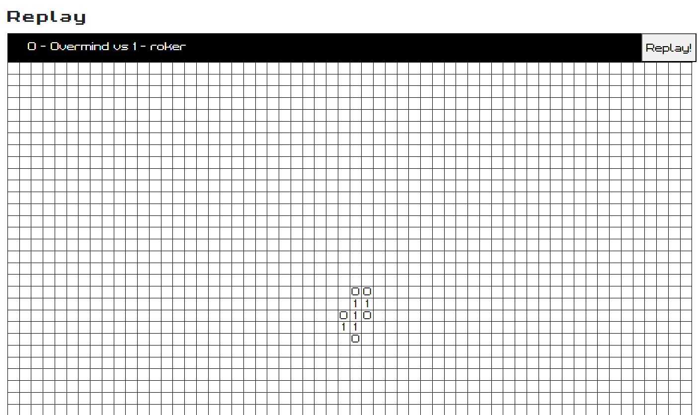
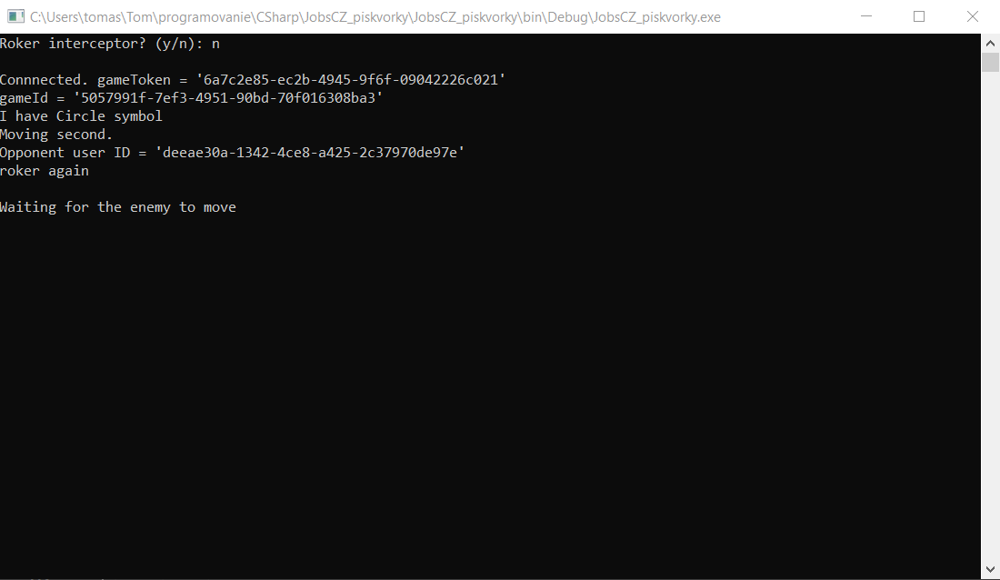
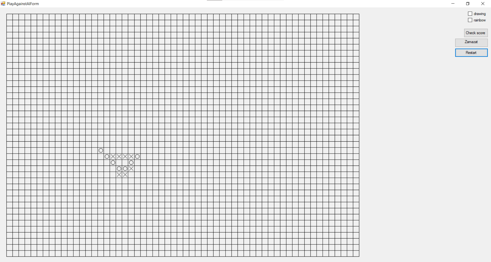

# JobsCZ_TicTacToe

This is a tic tac toe (five in a row) bot competing on a platform created by Jobs cz (https://piskvorky.jobs.cz/). Bots created in any programming language can compete there submitting their moves via http endpoints. (made in 2022)

The bot is customizable. New AIs can be created and used with the bot. It communicates with the website via HttpClient sending and receiveing json data. There is some multithreading used.

You can also play against an AI via desktop interface.

## Requirements
 - Visual Studio
 - Newtonsoft Json

## Credits
- [Tomáš Žilínek](https://www.linkedin.com/in/tomaszilinek)

